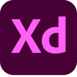
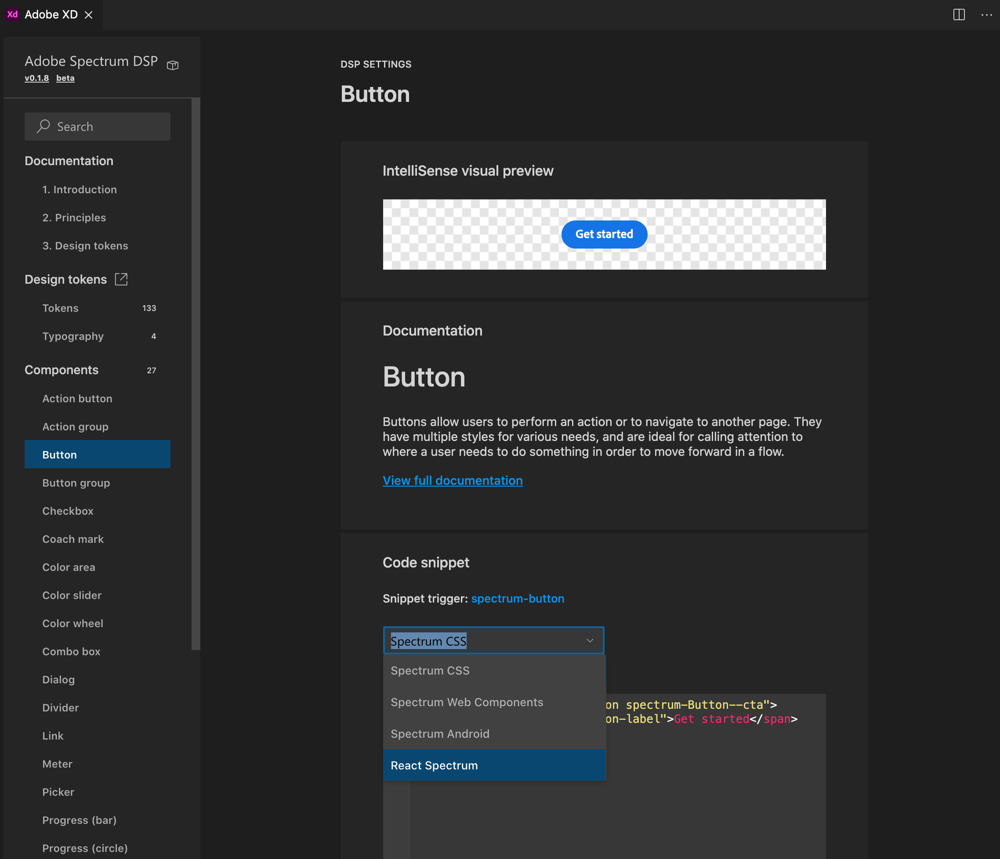
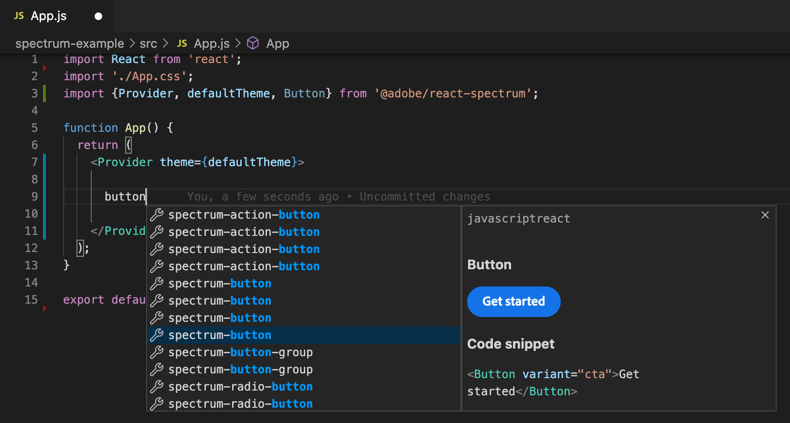
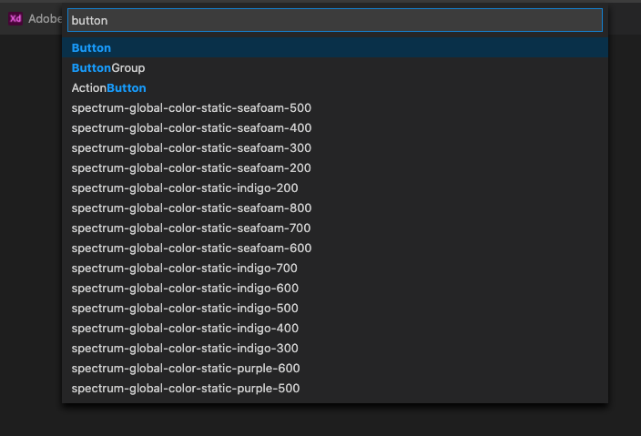
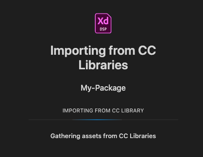
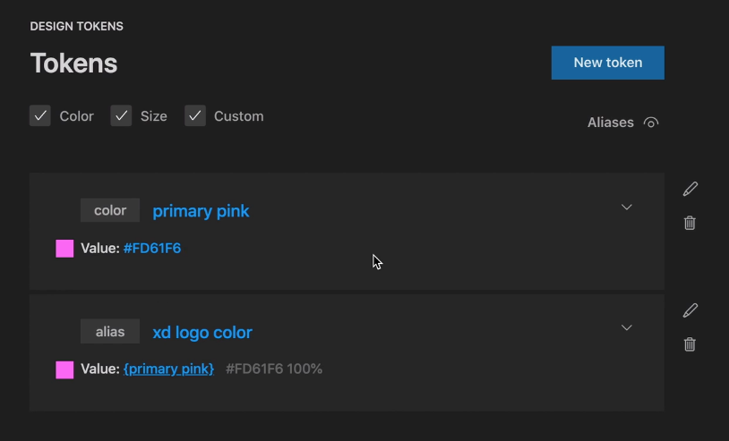
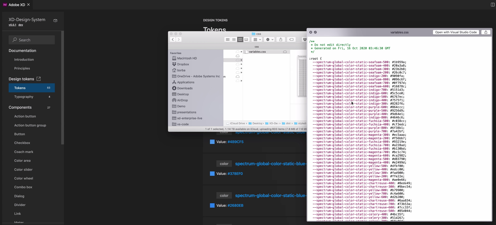

## Adobe XD Extension for Visual Studio Code

Design systems are the link between Design and Development. To build a successful, tailored, and widely-adopted system, both designers and developers need to have a seat at the table. The new Adobe XD Extension for Visual Studio Code allows developers to visually map design sources, created in XD and available in Creative Cloud Libraries, to platform-specific code using design tokens. DesignOps teams will be able to create shareable [Design System Packages (DSPs)](https://github.com/AdobeXD/design-system-package-dsp) that contain all the information developers need to consume while coding, including code snippets and documentation.

## Where can I learn how to use the extension or find DSPs

You can go to [letsxd.com/vscode](https://letsxd.com/vscode) to learn how to create or consume Design System Packages, as well as find popular DSPs to load and build your projects using the extension.

## Can this extension help you

The Adobe XD extension for Visual Studio Code can help accelerate or replace multiple existing workflows where:

- Developers building apps or websites need to quickly find design system information such as tokens and components.
- Teams, big or small, are interested in starting to work with tokens, but they don't know how to start.
- DesignOps teams are managing tokens manually in spreadsheets or documents.
- DesignOps developers are setting up build systems by hand/text to compile tokens to platform-specific code.
- Design tokens are being created manually. The extension allows teams to create tokens based on designs with one click in seconds, powered by CC Libraries, without having to have domain expertise on how to consume APIs or build systems.
- There is no common shared language for teams and tools to exchange design system information. [DSP](https://github.com/AdobeXD/design-system-package-dsp) is aiming to be an open platform for that.

# Consume a Design System Package (DSP)

Load DSPs to build apps and websites and access documentation, design tokens, and code snippets without ever leaving Visual Studio Code.

### Code snippets

*Code snippets for the same component in different implementations*

### Code completion

*Code completion for the same component in different implementations*

### Find tokens and components quickly

*Code snippets for the same component in different implementations*

# Create a new Design System Package (DSP)

Create and manage your DSPs visually. And, if you import from Creative Cloud Libraries, you get colors, character styles, and components, in seconds.

### Import from CC Libraries and create DSPs in seconds

*If your designers have Creative Cloud Libraries created in XD, you can import colors, character styles and components to speed up the creation of your DSPs.*

### Create tokens

*Create color, size, custom (numeric, string, boolean) and alias tokens, visually.*

### Compile tokens

*Compile tokens to platform-specific code, in seconds, powered by [Style Dictionary](https://amzn.github.io/style-dictionary/#/), preserving all of the tokens names you defined.*

# Have feature requests

Please use [Adobe XD on UserVoice](https://adobexd.uservoice.com/) and make sure to add "VS Code" to the feature request title.
